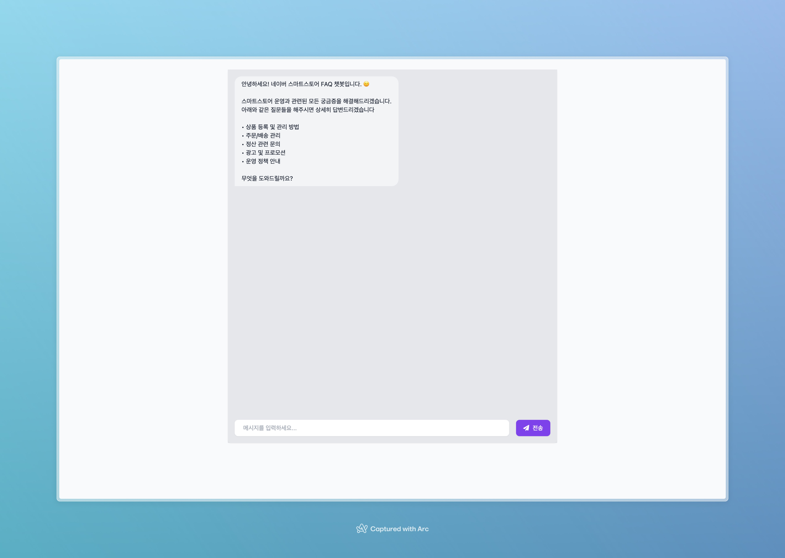

# 네이버 스마트스토어 FAQ 챗봇

## 필수 요구사항
- Python ^3.12.0
- Poetry ^1.8.2
- Docker
- Make

## 실행 방법

1. Repository clone
```bash
git clone https://github.com/PrimadonnaGit/naver-smartstore-faq-chatbot
cd naver-smartstore-faq-chatbot
```

2. Install & setup
```bash
make install
make setup
```

3. Setup `OPENAI_API_KEY`
```bash
vi .env.local

# .env.local
OPENAI_API_KEY=YOUR_OPENAI_API_KEY
```

4. Setup Redis
```bash
make redis-up
```

5. Data Preprocessing
- 네이버 스마트스토어 pickle 파일을 프로젝트의 `data/faq.pkl` 위치에 저장하고 아래 명령어 실행합니다.
```bash
make pre-start
```

6. Run
```bash
make run
```

7. Test
- 서버가 실행되면 http://localhost:8000 에서 챗봇을 테스트 하실 수 있습니다.

